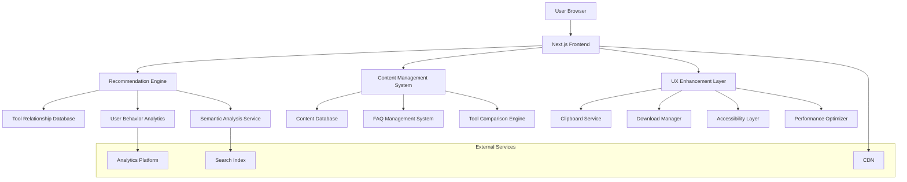

# Interlinking System Technical Architecture

## 1. System Overview

The interlinking system will be built as a modular, scalable architecture integrated with the existing Next.js application. The system will utilize AI-powered recommendations, dynamic content generation, and comprehensive UX enhancements to create a seamless user experience.

## 2. Architecture Design



## 3. Core Components

### 3.1 Recommendation Engine

#### 3.1.1 Architecture

```javascript
// Recommendation Engine Core
class RecommendationEngine {
  constructor(toolDatabase, userAnalytics, semanticService) {
    this.tools = toolDatabase;
    this.analytics = userAnalytics;
    this.semantic = semanticService;
  }
  
  async getRelatedTools(currentTool, context) {
    const semanticMatches = await this.semantic.findSimilarTools(currentTool);
    const behavioralMatches = await this.analytics.getPopularCombos(currentTool);
    const categoryMatches = this.tools.getByCategory(context.category);
    
    return this.rankAndFilter([
      ...semanticMatches,
      ...behavioralMatches,
      ...categoryMatches
    ], context);
  }
  
  async getContextualLinks(content, limit = 5) {
    const keywords = await this.semantic.extractKeywords(content);
    const relevantTools = await this.tools.findByKeywords(keywords);
    
    return this.generateAnchorTexts(relevantTools, content);
  }
}
```

#### 3.1.2 Database Schema

```sql
-- Tool Relationships Table
CREATE TABLE tool_relationships (
  id UUID PRIMARY KEY DEFAULT gen_random_uuid(),
  tool_id UUID REFERENCES tools(id),
  related_tool_id UUID REFERENCES tools(id),
  relationship_type VARCHAR(50), -- semantic, categorical, behavioral
  strength DECIMAL(3,2), -- 0.00 to 1.00
  created_at TIMESTAMP DEFAULT NOW(),
  updated_at TIMESTAMP DEFAULT NOW()
);

-- User Behavior Analytics Table
CREATE TABLE user_behavior (
  id UUID PRIMARY KEY DEFAULT gen_random_uuid(),
  session_id VARCHAR(255),
  tool_id UUID REFERENCES tools(id),
  action VARCHAR(50), -- view, use, share, download
  duration INTEGER, -- time spent in seconds
  timestamp TIMESTAMP DEFAULT NOW()
);

-- Semantic Keywords Table
CREATE TABLE tool_keywords (
  id UUID PRIMARY KEY DEFAULT gen_random_uuid(),
  tool_id UUID REFERENCES tools(id),
  keyword VARCHAR(100),
  relevance_score DECIMAL(3,2),
  category VARCHAR(50),
  created_at TIMESTAMP DEFAULT NOW()
);
```

### 3.2 Content Management System

#### 3.2.1 Content Generation Pipeline

```javascript
// Content Generator Service
class ContentGenerator {
  constructor(aiService, templateEngine, seoOptimizer) {
    this.ai = aiService;
    this.templates = templateEngine;
    this.seo = seoOptimizer;
  }
  
  async generateToolContent(toolData) {
    const sections = await Promise.all([
      this.generateIntroduction(toolData),
      this.generateHowItWorks(toolData),
      this.generateUseCases(toolData),
      this.generateBenefits(toolData),
      this.generateBestPractices(toolData)
    ]);
    
    return this.combineAndOptimize(sections);
  }
  
  async generateFAQs(toolData, count = 15) {
    const categories = ['general', 'technical', 'use-cases', 'troubleshooting'];
    const faqs = [];
    
    for (const category of categories) {
      const categoryFAQs = await this.ai.generateFAQs(toolData, category, Math.ceil(count / categories.length));
      faqs.push(...categoryFAQs);
    }
    
    return this.optimizeFAQs(faqs);
  }
}
```

#### 3.2.2 Content Templates

```javascript
// Content Template Structure
const ContentTemplates = {
  introduction: {
    template: "{toolName} is a powerful {category} tool that helps {targetAudience} achieve {primaryBenefit} by {coreFunctionality}.",
    minWords: 200,
    seoKeywords: ['tool', 'seo', 'optimization', 'analysis']
  },
  
  howItWorks: {
    template: "The {toolName} works by {technicalProcess}. Simply {userAction} and {expectedResult}.",
    minWords: 300,
    includeSteps: true,
    includeScreenshots: true
  },
  
  useCases: {
    template: "Common use cases for {toolName} include {useCase1}, {useCase2}, and {useCase3}.",
    minWords: 400,
    includeExamples: true,
    includeIndustries: true
  }
};
```

### 3.3 UX Enhancement Layer

#### 3.3.1 Clipboard Service

```javascript
// Advanced Clipboard Service
class ClipboardService {
  constructor() {
    this.fallback = new FallbackClipboard();
    this.permissions = new PermissionManager();
  }
  
  async copyToClipboard(text, format = 'text/plain') {
    try {
      // Try modern Clipboard API
      if (navigator.clipboard && window.isSecureContext) {
        await navigator.clipboard.writeText(text);
        return { success: true, method: 'modern' };
      }
      
      // Fallback to legacy method
      return await this.fallback.copy(text);
    } catch (error) {
      return this.handleError(error);
    }
  }
  
  async copyWithFormatting(code, format) {
    const formattedCode = this.formatCode(code, format);
    const result = await this.copyToClipboard(formattedCode);
    
    this.showFeedback(result.success, format);
    return result;
  }
  
  formatCode(code, format) {
    const formatters = {
      apache: this.formatApacheConfig,
      nginx: this.formatNginxConfig,
      php: this.formatPHPCode,
      html: this.formatHTMLCode,
      javascript: this.formatJavaScriptCode
    };
    
    return formatters[format] ? formatters[format](code) : code;
  }
}
```

#### 3.3.2 Download Manager

```javascript
// File Download Manager
class DownloadManager {
  constructor() {
    this.supportedFormats = ['.htaccess', '.php', '.html', '.js', '.conf'];
    this.mimeTypes = {
      '.htaccess': 'text/plain',
      '.php': 'application/x-httpd-php',
      '.html': 'text/html',
      '.js': 'application/javascript',
      '.conf': 'text/plain'
    };
  }
  
  downloadFile(content, filename, format) {
    const blob = this.createBlob(content, format);
    const url = URL.createObjectURL(blob);
    
    const link = document.createElement('a');
    link.href = url;
    link.download = this.sanitizeFilename(filename, format);
    link.style.display = 'none';
    
    document.body.appendChild(link);
    link.click();
    document.body.removeChild(link);
    
    URL.revokeObjectURL(url);
    
    this.trackDownload(format);
  }
  
  createZipArchive(files) {
    // Implementation using JSZip or similar library
    const zip = new JSZip();
    
    files.forEach(file => {
      zip.file(file.name, file.content);
    });
    
    return zip.generateAsync({ type: 'blob' });
  }
  
  sanitizeFilename(filename, format) {
    const sanitized = filename.replace(/[^a-zA-Z0-9-_]/g, '_');
    return `${sanitized}${format}`;
  }
}
```

## 4. Frontend Implementation

### 4.1 Component Architecture

#### 4.1.1 Related Tools Component

```javascript
// RelatedTools.jsx
import { useState, useEffect } from 'react';
import { getRelatedTools } from '@/lib/recommendations';

export default function RelatedTools({ currentTool, className }) {
  const [tools, setTools] = useState([]);
  const [loading, setLoading] = useState(true);
  
  useEffect(() => {
    async function fetchRelatedTools() {
      try {
        const relatedTools = await getRelatedTools(currentTool);
        setTools(relatedTools);
      } catch (error) {
        console.error('Failed to fetch related tools:', error);
      } finally {
        setLoading(false);
      }
    }
    
    fetchRelatedTools();
  }, [currentTool]);
  
  if (loading) return <RelatedToolsSkeleton />;
  
  return (
    <section className={className} aria-labelledby="related-tools">
      <h2 id="related-tools" className="text-lg font-semibold mb-4">
        Related Tools
      </h2>
      <div className="grid grid-cols-1 sm:grid-cols-2 lg:grid-cols-3 gap-4">
        {tools.map(tool => (
          <ToolCard key={tool.id} tool={tool} showDescription={true} />
        ))}
      </div>
    </section>
  );
}
```

#### 4.1.2 Contextual Links Component

```javascript
// ContextualLinks.jsx
import { useState, useEffect } from 'react';
import { getContextualLinks } from '@/lib/recommendations';

export default function ContextualLinks({ content, limit = 5 }) {
  const [links, setLinks] = useState([]);
  const [loading, setLoading] = useState(true);
  
  useEffect(() => {
    async function fetchContextualLinks() {
      try {
        const contextualLinks = await getContextualLinks(content, limit);
        setLinks(contextualLinks);
      } catch (error) {
        console.error('Failed to fetch contextual links:', error);
      } finally {
        setLoading(false);
      }
    }
    
    if (content) {
      fetchContextualLinks();
    }
  }, [content, limit]);
  
  if (loading || links.length === 0) return null;
  
  return (
    <div className="contextual-links mt-6">
      <h3 className="text-md font-medium mb-3">You might also find these helpful:</h3>
      <ul className="space-y-2">
        {links.map(link => (
          <li key={link.id}>
            <a 
              href={link.url} 
              className="text-brand-600 hover:text-brand-700 underline"
              title={link.description}
            >
              {link.anchorText}
            </a>
            {link.context && (
              <span className="text-sm text-gray-600 ml-2">
                - {link.context}
              </span>
            )}
          </li>
        ))}
      </ul>
    </div>
  );
}
```

### 4.2 Enhanced Tool Layout

#### 4.2.1 ToolLayout Component

```javascript
// ToolLayout.jsx
import { useState, useEffect } from 'react';
import RelatedTools from './RelatedTools';
import ContextualLinks from './ContextualLinks';
import FAQSection from './FAQSection';
import ContentExpansion from './ContentExpansion';

export default function ToolLayout({ tool, children, relatedTools }) {
  const [content, setContent] = useState('');
  
  useEffect(() => {
    // Extract text content for contextual linking
    const textContent = extractTextFromChildren(children);
    setContent(textContent);
  }, [children]);
  
  return (
    <div className="tool-layout max-w-6xl mx-auto px-4 py-8">
      {/* Breadcrumb Navigation */}
      <Breadcrumb tool={tool} />
      
      {/* Main Tool Content */}
      <article className="tool-main-content mb-12">
        {children}
      </article>
      
      {/* Contextual Links */}
      <ContextualLinks content={content} />
      
      {/* Related Tools */}
      <RelatedTools 
        currentTool={tool} 
        className="mb-12"
      />
      
      {/* FAQ Section */}
      <FAQSection tool={tool} className="mb-12" />
      
      {/* Content Expansion */}
      <ContentExpansion tool={tool} className="mb-12" />
      
      {/* Tool Comparison */}
      <ToolComparison currentTool={tool} className="mb-12" />
    </div>
  );
}
```

## 5. Performance Optimization

### 5.1 Caching Strategy

#### 5.1.1 Multi-Level Caching

```javascript
// Cache Manager
class CacheManager {
  constructor() {
    this.memoryCache = new Map();
    this.indexedDB = new IndexedDBCache('tool-cache');
    this.sessionCache = new SessionStorageCache();
  }
  
  async get(key, strategy = 'memory-first') {
    const caches = this.getCacheStrategy(strategy);
    
    for (const cache of caches) {
      const value = await cache.get(key);
      if (value !== null) {
        // Backfill faster caches
        this.backfillCaches(key, value, caches, cache);
        return value;
      }
    }
    
    return null;
  }
  
  async set(key, value, ttl = 3600000) { // 1 hour default
    const expiration = Date.now() + ttl;
    const cacheItem = { value, expiration };
    
    await Promise.all([
      this.memoryCache.set(key, cacheItem),
      this.indexedDB.set(key, cacheItem),
      this.sessionCache.set(key, cacheItem)
    ]);
  }
}
```

### 5.2 Lazy Loading Implementation

#### 5.2.1 Component-Level Lazy Loading

```javascript
// Lazy-loaded Components
const RelatedTools = dynamic(() => import('@/components/RelatedTools'), {
  loading: () => <RelatedToolsSkeleton />,
  ssr: false
});

const FAQSection = dynamic(() => import('@/components/FAQSection'), {
  loading: () => <FAQSectionSkeleton />,
  ssr: true
});

const ContentExpansion = dynamic(() => import('@/components/ContentExpansion'), {
  loading: () => <ContentExpansionSkeleton />,
  ssr: true
});
```

#### 5.2.2 Image and Asset Optimization

```javascript
// Optimized Image Component
import Image from 'next/image';

export function OptimizedToolImage({ src, alt, priority = false }) {
  return (
    <div className="relative overflow-hidden rounded-lg">
      <Image
        src={src}
        alt={alt}
        width={400}
        height={300}
        priority={priority}
        loading={priority ? 'eager' : 'lazy'}
        placeholder="blur"
        blurDataURL={generateBlurDataURL(src)}
        className="object-cover transition-transform duration-300 hover:scale-105"
      />
    </div>
  );
}
```

## 6. Accessibility Implementation

### 6.1 ARIA Compliance

#### 6.1.1 Semantic Structure

```javascript
// Accessible Tool Card
export function ToolCard({ tool, showDescription }) {
  return (
    <article 
      className="tool-card"
      role="article"
      aria-labelledby={`tool-title-${tool.id}`}
      aria-describedby={`tool-description-${tool.id}`}
    >
      <header className="tool-card-header">
        <h3 id={`tool-title-${tool.id}`} className="tool-card-title">
          <Link href={`/tools/${tool.slug}`}>
            <a aria-label={`Learn more about ${tool.name}`}>
              {tool.name}
            </a>
          </Link>
        </h3>
      </header>
      
      {showDescription && (
        <div id={`tool-description-${tool.id}`} className="tool-card-description">
          <p>{tool.description}</p>
        </div>
      )}
      
      <footer className="tool-card-footer">
        <button 
          aria-label={`Try ${tool.name} tool`}
          className="btn btn-primary"
          onClick={() => navigateToTool(tool.slug)}
        >
          Try Tool
        </button>
      </footer>
    </article>
  );
}
```

### 6.2 Keyboard Navigation

#### 6.2.1 Focus Management

```javascript
// Focus Management Hook
export function useFocusManagement() {
  const [focusableElements, setFocusableElements] = useState([]);
  const [currentFocusIndex, setCurrentFocusIndex] = useState(0);
  
  useEffect(() => {
    const elements = Array.from(
      document.querySelectorAll(
        'a, button, input, select, textarea, [tabindex]:not([tabindex="-1"])'
      )
    );
    setFocusableElements(elements);
  }, []);
  
  const handleKeyDown = useCallback((event) => {
    if (event.key === 'Tab') {
      // Handle tab navigation
      if (event.shiftKey) {
        // Shift+Tab (backward)
        setCurrentFocusIndex(prev => 
          prev > 0 ? prev - 1 : focusableElements.length - 1
        );
      } else {
        // Tab (forward)
        setCurrentFocusIndex(prev => 
          prev < focusableElements.length - 1 ? prev + 1 : 0
        );
      }
      
      focusableElements[currentFocusIndex]?.focus();
      event.preventDefault();
    }
  }, [focusableElements, currentFocusIndex]);
  
  useEffect(() => {
    document.addEventListener('keydown', handleKeyDown);
    return () => document.removeEventListener('keydown', handleKeyDown);
  }, [handleKeyDown]);
}
```

## 7. SEO and Performance Monitoring

### 7.1 SEO Optimization

#### 7.1.1 Structured Data Implementation

```javascript
// Dynamic Schema Generator
export function generateToolSchema(tool) {
  return {
    "@context": "https://schema.org",
    "@type": "SoftwareApplication",
    "name": tool.name,
    "description": tool.description,
    "url": `https://100seotools.com/tools/${tool.slug}`,
    "applicationCategory": "SEOApplication",
    "operatingSystem": "Web",
    "offers": {
      "@type": "Offer",
      "price": "0",
      "priceCurrency": "USD"
    },
    "aggregateRating": {
      "@type": "AggregateRating",
      "ratingValue": tool.rating || "4.5",
      "ratingCount": tool.reviewCount || "100"
    }
  };
}

export function generateFAQSchema(faqs) {
  return {
    "@context": "https://schema.org",
    "@type": "FAQPage",
    "mainEntity": faqs.map(faq => ({
      "@type": "Question",
      "name": faq.question,
      "acceptedAnswer": {
        "@type": "Answer",
        "text": faq.answer
      }
    }))
  };
}
```

### 7.2 Performance Monitoring

#### 7.2.1 Core Web Vitals Tracking

```javascript
// Performance Monitor
class PerformanceMonitor {
  constructor() {
    this.metrics = {
      LCP: [],
      FID: [],
      CLS: [],
      TTFB: [],
      FCP: []
    };
  }
  
  init() {
    // Monitor Largest Contentful Paint
    new PerformanceObserver((list) => {
      for (const entry of list.getEntries()) {
        this.metrics.LCP.push(entry.startTime);
        this.reportMetric('LCP', entry.startTime);
      }
    }).observe({ entryTypes: ['largest-contentful-paint'] });
    
    // Monitor First Input Delay
    new PerformanceObserver((list) => {
      for (const entry of list.getEntries()) {
        this.metrics.FID.push(entry.processingStart - entry.startTime);
        this.reportMetric('FID', entry.processingStart - entry.startTime);
      }
    }).observe({ entryTypes: ['first-input'] });
    
    // Monitor Cumulative Layout Shift
    new PerformanceObserver((list) => {
      for (const entry of list.getEntries()) {
        if (!entry.hadRecentInput) {
          this.metrics.CLS.push(entry.value);
          this.reportMetric('CLS', entry.value);
        }
      }
    }).observe({ entryTypes: ['layout-shift'] });
  }
  
  reportMetric(name, value) {
    // Send to analytics platform
    gtag('event', 'web_vitals', {
      event_category: 'Web Vitals',
      event_label: name,
      value: Math.round(name === 'CLS' ? value * 1000 : value),
      non_interaction: true
    });
  }
}
```

## 8. Deployment Strategy

### 8.1 Staged Rollout

#### 8.1.1 Feature Flag System

```javascript
// Feature Flag Manager
class FeatureFlagManager {
  constructor() {
    this.flags = new Map();
    this.userSegments = new Map();
  }
  
  async isEnabled(flagName, userId = null) {
    const flag = this.flags.get(flagName);
    if (!flag) return false;
    
    if (userId && flag.rolloutPercentage < 100) {
      const userInSegment = await this.isUserInSegment(userId, flagName);
      return userInSegment && flag.enabled;
    }
    
    return flag.enabled;
  }
  
  async enableForUser(flagName, userId) {
    const segment = this.userSegments.get(flagName) || new Set();
    segment.add(userId);
    this.userSegments.set(flagName, segment);
  }
}

// Usage in Components
export function RelatedTools({ tool }) {
  const { isEnabled } = useFeatureFlags();
  const [aiRecommendations, setAiRecommendations] = useState(false);
  
  useEffect(() => {
    async function checkFeatureFlag() {
      const enabled = await isEnabled('ai-recommendations');
      setAiRecommendations(enabled);
    }
    checkFeatureFlag();
  }, []);
  
  if (!aiRecommendations) {
    return <LegacyRelatedTools tool={tool} />;
  }
  
  return <AIRecommendedTools tool={tool} />;
}
```

This technical architecture provides a comprehensive foundation for implementing the interlinking system and content enhancements. The modular design ensures scalability, maintainability, and optimal performance while maintaining excellent user experience and SEO benefits.
